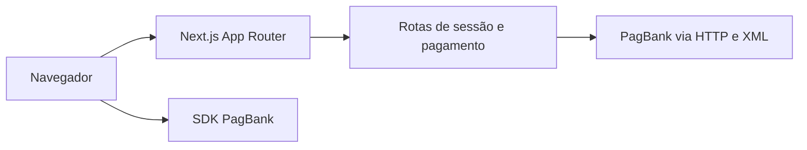
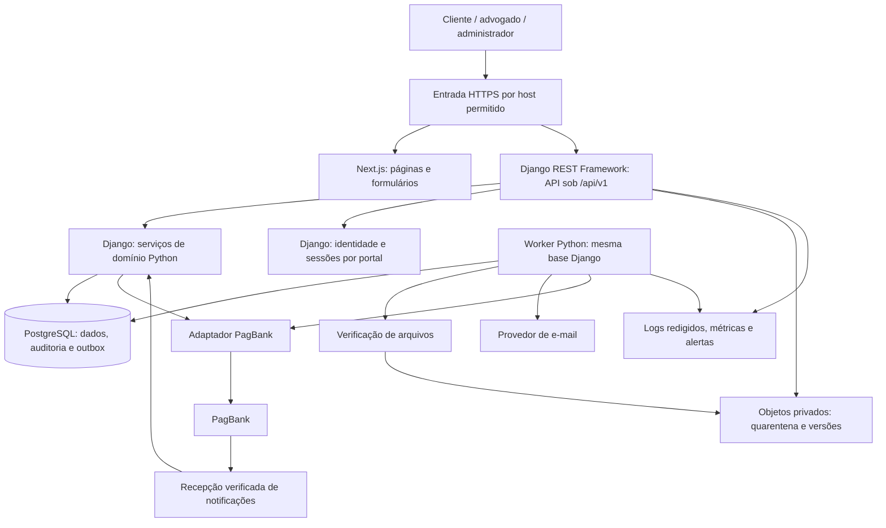

# Arquitetura

> Revisão 1.3 · Base: 16/09/2026 · Arquitetura aprovada e estrutura inicial criada. Dependências locais estão travadas; produção e fornecedores ainda dependem de validação.

## Arquitetura encontrada



A aplicação original foi preservada em `frontend/`, com páginas React, CSS e dois Route Handlers. Ao lado dela foi criado `backend/`, com Django/DRF, usuário UUID/e-mail, migração inicial e GET `/api/v1/health/`; a integração com as telas ainda não existe. Não há PostgreSQL em operação, autenticação dos portais, autorização por caso, armazenamento privado nem worker funcional. A tela de acesso permanece demonstrativa. O SDK tokeniza o cartão, mas o formulário também envia os campos de cartão ao backend próprio: correção prioritária documentada em AT-01. O diagrama acima representa o fluxo legado ainda ativo.

## Arquitetura aprovada para implementação



Um repositório, frontend Next.js, API Django e worker Python como processos separados; o backend continua sendo um monólito modular. PostgreSQL é acessado pelo Django ORM e pelo worker do mesmo backend. Next.js não acessa tabelas nem decide autorização, vigência ou confirmação financeira. Formulários podem validar para orientar o usuário, mas a decisão autoritativa pertence ao Django.

Fila persistente inicial: outbox em PostgreSQL, consumida pelo worker Python com reserva de job, lease, tentativas limitadas e retomada após falha. Não depender de threads de requisição ou callbacks em memória para entregar eventos. Banco e chamadas externas não compartilham transação: consumidores precisam ser idempotentes, pois um job pode ser executado novamente. Celery/Redis não são dependências obrigatórias desta decisão; adotar outro executor exigirá justificar custo operacional e preservar a outbox.

## Portais, sessão e fronteira HTTP

Endereços ilustrativos: `www.seudominio.com.br` para apresentação, `app.seudominio.com.br` para cliente e `advogados.seudominio.com.br` para equipe. Em cada portal autenticado, a entrada encaminha `/api/v1/*` diretamente ao Django e demais rotas ao Next.js. Para o navegador, a API usa a mesma origem do portal; não é necessário compartilhar cookie entre subdomínios nem abrir CORS amplo. Domínios reais e provedor da entrada HTTPS permanecem pendentes.

Sessões ficam no banco pelo mecanismo do Django, com registro de portal, usuário, expiração, revogação e estado de MFA. A aplicação verifica o portal da sessão a cada requisição; copiar uma sessão do cliente para o portal profissional não concede acesso. Cookie de sessão `__Host-iustus_session`: Secure, HttpOnly, Path=/, sem Domain, SameSite=Lax como defesa adicional. Cada host mantém seu próprio cookie. Login da equipe exige papel permitido e MFA completo; uma etapa de MFA pendente não cria sessão profissional plenamente autorizada. [Sessões Django](https://docs.djangoproject.com/en/5.2/topics/http/sessions/).

A entrada remove headers de encaminhamento enviados pelo público e define contexto confiável de host/esquema. Django aceita somente hosts configurados e valida o contexto do portal contra o registro da sessão. Acesso direto à origem da API é restrito à infraestrutura; corpo JSON ou header arbitrário do navegador não escolhe portal, usuário ou papel.

Mutações usam CSRF e checagem de origem, incluindo login e cadastro. Token obtido na mesma origem por `/api/v1/auth/csrf`, enviado em `X-CSRFToken` e renovado depois do login. Não confiar apenas em SameSite para separar subdomínios irmãos. Webhook PagBank é uma exceção específica à sessão/CSRF, autenticada pelo mecanismo do produto financeiro confirmado. Ver [API](API.md) e [Segurança](SEGURANCA.md).

Respostas privadas usam `Cache-Control: no-store`; páginas autenticadas não entram em cache compartilhado. Se houver chamada ao Django durante renderização no servidor Next.js, ela encaminha apenas o contexto permitido da requisição atual, por canal interno confiável; não usa conta privilegiada genérica para ler dados de clientes.

## Módulos e fronteiras

| Módulo | Responsabilidade | Não deve fazer |
| --- | --- | --- |
| Identity | Usuário Django, sessão por portal, perfil, convite, papéis, MFA e revogação | Decidir se caso pertence ao usuário sem consultar vínculo |
| Billing | Plano, pedido, cotação, evento financeiro e vigência | Aceitar total arbitrário do navegador ou liberar por token |
| Cases | Estados, triagem, atribuição, pendências e encerramento | Enviar e-mail diretamente dentro da transação |
| Documents | Metadados, versões, quarentena, acesso e exportação | Expor bucket público ou permitir download não verificado |
| Legal | Procuração, processo/partes, etapas contratadas, peças, revisão, protocolo, audiências e prazos informados | Calcular prazo processual ou afirmar protocolo automático |
| Communication | Timeline filtrada, mensagens, avisos e e-mail | Expor notas internas ao cliente |
| Administration | Gestão operacional e intervenções justificadas | Conceder leitura irrestrita de conteúdo jurídico ao papel admin |
| Privacy / Audit | Solicitações, retenção, evidências e consulta restrita | Prometer eliminação sem analisar impedimentos |

## Estrutura criada e responsabilidades futuras

```text
frontend/
  app/                        # Next.js: páginas e componentes existentes
  src/lib/api/                # Base TypeScript; cliente autenticado ainda pendente
backend/
  manage.py
  pyproject.toml              # Dependências Python e metadados
  requirements.lock           # Versões verificadas na fundação local
  config/                    # Settings por ambiente, URLs e entrada do servidor
  apps/
    identity/ billing/ cases/ documents/ legal/ communication/ administration/ privacy/ audit/
    # Cada app: modelos, serviços, serializers, endpoints, migrations e testes
  integrations/              # PagBank, e-mail, objetos e scanner
  jobs/                      # Fronteira reservada ao worker; consumidores pendentes
infra/                       # PostgreSQL local e diretrizes de proxy/deploy
tests/e2e/                   # Jornadas Next.js + Django
docs/                        # Contratos e decisões
```

Esses diretórios já existem. Os módulos de negócio são estrutura inicial; apenas identidade tem modelo/migração, e a única rota Django é liveness. A fundação foi verificada com Python 3.14.3, Django 5.2.17, DRF 3.18.1 e Node 24.14.1. Há configuração TypeScript incremental; a landing e o checkout originais foram preservados byte a byte. Proxy produtivo, OpenAPI, jobs e configuração de produção ainda serão implementados.

DRF define os endpoints e serializers; os serviços Python concentram regras e transações. Permissões por caso são próprias da Iustus: filtrar listagens e validar criação, leitura e alteração explicitamente, inclusive em caminhos administrativos. As permissões genéricas não resolvem isso automaticamente. [Permissões DRF](https://www.django-rest-framework.org/api-guide/permissions/).

Django Admin é ferramenta interna, não substitui os dashboards. Só habilitar modelos e ações necessários, com MFA, acesso restrito e aplicação das mesmas regras de domínio. Proibir edição direta de estado financeiro, publicação e histórico por CRUD genérico; essas operações usam os serviços auditados. Não distribuir superusuário para a rotina dos advogados.

## Transações e efeitos externos

Operação de caso: autenticar → autorizar vínculo → validar entrada e versão → gravar mudança + evento de histórico + outbox numa transação → confirmar → worker entrega avisos. Evento financeiro: verificar origem conforme produto habilitado → deduplicar → consultar estado autoritativo quando necessário → atualizar pedido/assinatura + auditoria + outbox atomicamente.

Implementar transações de domínio com Django ORM e `transaction.atomic()`. Notificar o worker após commit pode reduzir latência, mas a outbox persistida é a fonte de recuperação; `on_commit` isolado não substitui fila durável. [Transações Django](https://docs.djangoproject.com/en/5.2/topics/db/transactions/).

## Transição a partir do código existente

Criar e verificar a base Django, identidade e fronteira entre portais antes dos módulos de negócio. Implementar o adaptador PagBank no backend Python nas tarefas financeiras e trocar o frontend para `/api/v1/billing/*`. Depois da validação, desativar as duas rotas legadas de cobrança/sessão no Next.js; não manter dois caminhos financeiros independentes. Nesta entrega documental elas permanecem como encontradas, inclusive com os riscos descritos no inventário.

Objetos não compartilham transação com banco: iniciar upload em quarentena com prazo de expiração; confirmar metadados/hash; verificar; liberar. Job de limpeza remove uploads abandonados somente após checar referências e retenção. Exportações têm validade curta e autorização no acesso.

## Capacidade e evolução

Planejar primeiro uma operação com 20 usuários simultâneos de referência para testes, sem extrapolar esse cenário para capacidade comercial. Medir antes de escalar. Paginar listas, indexar consultas por proprietário/atribuição e estado, separar downloads do servidor web e limitar concorrência do worker. Reavaliar extração de serviços somente se carga, equipe ou isolamento exigirem.

Metas operacionais estão em [RNF](REQUISITOS_NAO_FUNCIONAIS.md). Não há hospedagem ou custos aprovados; regionamento, residência de dados e backup dependem de EXT-03 e EXT-02. Versões instaladas não são recomendação de segurança: DEV-004 e DEV-044 devem revisar suporte e atualizações antes de publicar.
