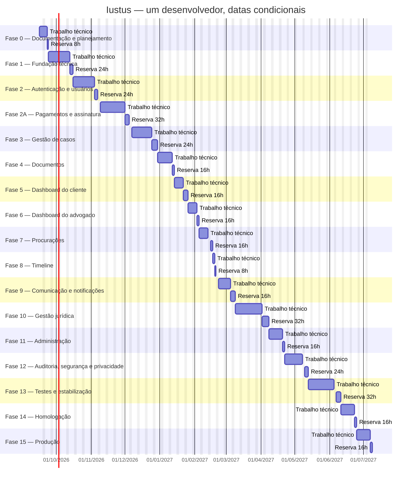

# Cronograma e previsão do MVP

> Revisão 1.5 · Base: 16/09/2026 · Arquitetura aprovada; validação operacional pendente.

## Previsão do projeto

Arquitetura aprovada: Next.js + TypeScript no frontend, Python + Django REST Framework no backend, PostgreSQL e worker Python separado. DEV-059 a DEV-064 acrescentam 80h técnicas para integração, isolamento dos portais e operação; reserva recalculada por fase.

**Início de referência:** 16/09/2026

**Desenvolvedor:** 1 · **Carga:** 8h/dia · **Carga semanal:** 40h

**Horas técnicas planejadas:** 1360h

**Contingência:** 336h (24,71% efetivos)

**Total:** 1696h · **Dias de capacidade:** 212 · **Semanas de capacidade:** 42,4

**MVP Feature Complete:** 12/05/2027

**Homologação concluída:** 24/06/2027

**Produção validada:** 08/07/2027

**Datas condicionais, não compromisso de entrega.** Calendário provisório de segunda a sexta-feira; feriados, férias e ausências ainda não descontados. As datas dependem da confirmação do calendário e das dependências externas. A data inicial é a data desta documentação, não uma declaração de que o desenvolvimento começou. Se o início real mudar, atualizar a configuração e recalcular antes de usar as datas. Aprovações externas podem deslocar os marcos além da reserva.

## Método e calendário

1. Somar as estimativas individuais do [Backlog](BACKLOG.md), sem paralelismo entre tarefas.
2. Reservar 20% por fase, arredondados para o próximo dia de 8h. Por isso a reserva efetiva supera 20%; o arredondamento fica visível na tabela.
3. Alocar tarefas e reserva em dias inteiros; o primeiro dia trabalhado conta como dia 1. Data final é inclusiva; na coluna Mermaid, término é exclusivo para renderizar o último dia.
4. Trabalhar de segunda a sexta, 8h/dia; não assumir QA, designer, DevOps ou especialista separado. Horas técnicas incluem documentação/revisão, desenvolvimento, configuração, testes e implantação.
5. Feriados, férias e ausências: lista **nonWorkingDates** inicialmente vazia, pois local e calendário do desenvolvedor não foram confirmados. Não interpretar a previsão como calendário nacional homologado. Informar cada dia sem expediente em ISO e regenerar. Horas/8 são dias de capacidade; semanas/40 não são semanas corridas.
6. Reservas aparecem após cada fase para tornar a previsão conservadora. Só consumir por desvio registrado; não criar funcionalidade extra para preencher reserva. Ganhos e desvios exigem revisão da baseline.

## Fases e reservas

| Fase | Entrega | Técnicas h | Reserva h | Total h | Início | Fim com reserva |
| --- | --- | --- | --- | --- | --- | --- |
| 0 | Documentação e planejamento | 40 | 8 | 48 | 16/09/2026 | 23/09/2026 |
| 1 | Fundação técnica | 104 | 24 | 128 | 24/09/2026 | 15/10/2026 |
| 2 | Autenticação e usuários | 104 | 24 | 128 | 16/10/2026 | 06/11/2026 |
| 2A | Pagamentos e assinatura | 128 | 32 | 160 | 09/11/2026 | 04/12/2026 |
| 3 | Gestão de casos | 112 | 24 | 136 | 07/12/2026 | 29/12/2026 |
| 4 | Documentos | 72 | 16 | 88 | 30/12/2026 | 13/01/2027 |
| 5 | Dashboard do cliente | 48 | 16 | 64 | 14/01/2027 | 25/01/2027 |
| 6 | Dashboard do advogado | 48 | 16 | 64 | 26/01/2027 | 04/02/2027 |
| 7 | Procurações | 48 | 16 | 64 | 05/02/2027 | 16/02/2027 |
| 8 | Timeline | 16 | 8 | 24 | 17/02/2027 | 19/02/2027 |
| 9 | Comunicação e notificações | 72 | 16 | 88 | 22/02/2027 | 08/03/2027 |
| 10 | Gestão jurídica | 144 | 32 | 176 | 09/03/2027 | 07/04/2027 |
| 11 | Administração | 64 | 16 | 80 | 08/04/2027 | 21/04/2027 |
| 12 | Auditoria, segurança e privacidade | 96 | 24 | 120 | 22/04/2027 | 12/05/2027 |
| 13 | Testes e estabilização | 136 | 32 | 168 | 13/05/2027 | 10/06/2027 |
| 14 | Homologação | 64 | 16 | 80 | 11/06/2027 | 24/06/2027 |
| 15 | Produção | 64 | 16 | 80 | 25/06/2027 | 08/07/2027 |

**Totais:** 1360h técnicas + 336h de contingência = 1696h. A fase 2A explicita pagamentos e assinatura sem renumerar as fases 0–15 das diretrizes originais.

## Marcos e critérios

As datas incluem todas as tarefas e reservas acumuladas até o final da fase indicada. M0 significa revisão aceita da documentação, não só arquivos criados. M8 significa escopo implementado; regressão, homologação e publicação continuam depois dele.

| Marco | Resultado | Até fase | Horas acumuladas | Dias acumulados | Data prevista |
| --- | --- | --- | --- | --- | --- |
| M0 | Documentação revisada | 0 | 48 | 6 | 23/09/2026 |
| M1 | Fundação funcionando | 1 | 176 | 22 | 15/10/2026 |
| M2 | Autenticação funcionando | 2 | 304 | 38 | 06/11/2026 |
| M3 | Cliente consegue abrir caso | 5 | 752 | 94 | 25/01/2027 |
| M4 | Advogado recebe e trabalha no caso | 6 | 816 | 102 | 04/02/2027 |
| M5 | Procuração funcionando | 7 | 880 | 110 | 16/02/2027 |
| M6 | Acompanhamento completo | 9 | 992 | 124 | 08/03/2027 |
| M7 | Fluxo jurídico completo | 10 | 1168 | 146 | 07/04/2027 |
| M8 | MVP Feature Complete | 12 | 1368 | 171 | 12/05/2027 |
| M9 | Homologação concluída | 14 | 1616 | 202 | 24/06/2027 |
| M10 | Produção validada | 15 | 1696 | 212 | 08/07/2027 |

Critérios de passagem: M1 ambientes/migrações verificáveis; M2 cadastro, sessão e papéis; M3 assinatura, abertura e documentos no painel; M4 triagem e fila profissional; M5 geração e conferência de procuração; M6 timeline, mensagens e avisos; M7 peça revisada, protocolo manual e prazos; M8 administração e privacidade completas; M9 roteiro aprovado e sem bloqueadores; M10 implantação, restauração e monitoramento verificados. Relacionar evidências de execução a cada marco quando ocorrer.

## Roadmap visual

As barras técnicas e de reserva são separadas. Toda linha depende do término da anterior por capacidade do único desenvolvedor; dependências técnicas específicas estão no backlog. As datas explícitas evitam divergência entre o Gantt e o cálculo.

## Alocação por tarefa

| Item | Fase | Horas | Início | Fim | Horas acumuladas |
| --- | --- | --- | --- | --- | --- |
| DEV-001 | 0 | 8 | 16/09/2026 | 16/09/2026 | 8 |
| DEV-002 | 0 | 16 | 17/09/2026 | 18/09/2026 | 24 |
| DEV-003 | 0 | 16 | 21/09/2026 | 22/09/2026 | 40 |
| RES-0 | 0 | 8 | 23/09/2026 | 23/09/2026 | 48 |
| DEV-004 | 1 | 16 | 24/09/2026 | 25/09/2026 | 64 |
| DEV-059 | 1 | 16 | 28/09/2026 | 29/09/2026 | 80 |
| DEV-005 | 1 | 24 | 30/09/2026 | 02/10/2026 | 104 |
| DEV-006 | 1 | 16 | 05/10/2026 | 06/10/2026 | 120 |
| DEV-060 | 1 | 16 | 07/10/2026 | 08/10/2026 | 136 |
| DEV-007 | 1 | 16 | 09/10/2026 | 12/10/2026 | 152 |
| RES-1 | 1 | 24 | 13/10/2026 | 15/10/2026 | 176 |
| DEV-008 | 2 | 24 | 16/10/2026 | 20/10/2026 | 200 |
| DEV-009 | 2 | 24 | 21/10/2026 | 23/10/2026 | 224 |
| DEV-061 | 2 | 16 | 26/10/2026 | 27/10/2026 | 240 |
| DEV-010 | 2 | 16 | 28/10/2026 | 29/10/2026 | 256 |
| DEV-011 | 2 | 24 | 30/10/2026 | 03/11/2026 | 280 |
| RES-2 | 2 | 24 | 04/11/2026 | 06/11/2026 | 304 |
| DEV-012 | 2A | 16 | 09/11/2026 | 10/11/2026 | 320 |
| DEV-013 | 2A | 24 | 11/11/2026 | 13/11/2026 | 344 |
| DEV-062 | 2A | 8 | 16/11/2026 | 16/11/2026 | 352 |
| DEV-014 | 2A | 24 | 17/11/2026 | 19/11/2026 | 376 |
| DEV-015 | 2A | 32 | 20/11/2026 | 25/11/2026 | 408 |
| DEV-016 | 2A | 24 | 26/11/2026 | 30/11/2026 | 432 |
| RES-2A | 2A | 32 | 01/12/2026 | 04/12/2026 | 464 |
| DEV-017 | 3 | 24 | 07/12/2026 | 09/12/2026 | 488 |
| DEV-055 | 3 | 24 | 10/12/2026 | 14/12/2026 | 512 |
| DEV-018 | 3 | 24 | 15/12/2026 | 17/12/2026 | 536 |
| DEV-019 | 3 | 24 | 18/12/2026 | 22/12/2026 | 560 |
| DEV-020 | 3 | 16 | 23/12/2026 | 24/12/2026 | 576 |
| RES-3 | 3 | 24 | 25/12/2026 | 29/12/2026 | 600 |
| DEV-021 | 4 | 24 | 30/12/2026 | 01/01/2027 | 624 |
| DEV-022 | 4 | 24 | 04/01/2027 | 06/01/2027 | 648 |
| DEV-023 | 4 | 24 | 07/01/2027 | 11/01/2027 | 672 |
| RES-4 | 4 | 16 | 12/01/2027 | 13/01/2027 | 688 |
| DEV-024 | 5 | 24 | 14/01/2027 | 18/01/2027 | 712 |
| DEV-025 | 5 | 24 | 19/01/2027 | 21/01/2027 | 736 |
| RES-5 | 5 | 16 | 22/01/2027 | 25/01/2027 | 752 |
| DEV-026 | 6 | 24 | 26/01/2027 | 28/01/2027 | 776 |
| DEV-027 | 6 | 24 | 29/01/2027 | 02/02/2027 | 800 |
| RES-6 | 6 | 16 | 03/02/2027 | 04/02/2027 | 816 |
| DEV-028 | 7 | 24 | 05/02/2027 | 09/02/2027 | 840 |
| DEV-029 | 7 | 24 | 10/02/2027 | 12/02/2027 | 864 |
| RES-7 | 7 | 16 | 15/02/2027 | 16/02/2027 | 880 |
| DEV-030 | 8 | 16 | 17/02/2027 | 18/02/2027 | 896 |
| RES-8 | 8 | 8 | 19/02/2027 | 19/02/2027 | 904 |
| DEV-031 | 9 | 24 | 22/02/2027 | 24/02/2027 | 928 |
| DEV-032 | 9 | 24 | 25/02/2027 | 01/03/2027 | 952 |
| DEV-033 | 9 | 24 | 02/03/2027 | 04/03/2027 | 976 |
| RES-9 | 9 | 16 | 05/03/2027 | 08/03/2027 | 992 |
| DEV-034 | 10 | 32 | 09/03/2027 | 12/03/2027 | 1024 |
| DEV-035 | 10 | 24 | 15/03/2027 | 17/03/2027 | 1048 |
| DEV-036 | 10 | 24 | 18/03/2027 | 22/03/2027 | 1072 |
| DEV-056 | 10 | 24 | 23/03/2027 | 25/03/2027 | 1096 |
| DEV-057 | 10 | 16 | 26/03/2027 | 29/03/2027 | 1112 |
| DEV-037 | 10 | 24 | 30/03/2027 | 01/04/2027 | 1136 |
| RES-10 | 10 | 32 | 02/04/2027 | 07/04/2027 | 1168 |
| DEV-038 | 11 | 24 | 08/04/2027 | 12/04/2027 | 1192 |
| DEV-039 | 11 | 16 | 13/04/2027 | 14/04/2027 | 1208 |
| DEV-040 | 11 | 24 | 15/04/2027 | 19/04/2027 | 1232 |
| RES-11 | 11 | 16 | 20/04/2027 | 21/04/2027 | 1248 |
| DEV-041 | 12 | 24 | 22/04/2027 | 26/04/2027 | 1272 |
| DEV-042 | 12 | 32 | 27/04/2027 | 30/04/2027 | 1304 |
| DEV-043 | 12 | 16 | 03/05/2027 | 04/05/2027 | 1320 |
| DEV-044 | 12 | 24 | 05/05/2027 | 07/05/2027 | 1344 |
| RES-12 | 12 | 24 | 10/05/2027 | 12/05/2027 | 1368 |
| DEV-045 | 13 | 24 | 13/05/2027 | 17/05/2027 | 1392 |
| DEV-063 | 13 | 16 | 18/05/2027 | 19/05/2027 | 1408 |
| DEV-046 | 13 | 32 | 20/05/2027 | 25/05/2027 | 1440 |
| DEV-058 | 13 | 16 | 26/05/2027 | 27/05/2027 | 1456 |
| DEV-047 | 13 | 24 | 28/05/2027 | 01/06/2027 | 1480 |
| DEV-048 | 13 | 24 | 02/06/2027 | 04/06/2027 | 1504 |
| RES-13 | 13 | 32 | 07/06/2027 | 10/06/2027 | 1536 |
| DEV-049 | 14 | 16 | 11/06/2027 | 14/06/2027 | 1552 |
| DEV-050 | 14 | 24 | 15/06/2027 | 17/06/2027 | 1576 |
| DEV-051 | 14 | 24 | 18/06/2027 | 22/06/2027 | 1600 |
| RES-14 | 14 | 16 | 23/06/2027 | 24/06/2027 | 1616 |
| DEV-052 | 15 | 24 | 25/06/2027 | 29/06/2027 | 1640 |
| DEV-064 | 15 | 8 | 30/06/2027 | 30/06/2027 | 1648 |
| DEV-053 | 15 | 16 | 01/07/2027 | 02/07/2027 | 1664 |
| DEV-054 | 15 | 16 | 05/07/2027 | 06/07/2027 | 1680 |
| RES-15 | 15 | 16 | 07/07/2027 | 08/07/2027 | 1696 |

## Dependências externas e atualização

EXT-01 a EXT-06 estão em [Decisões](DECISOES.md); esperar por validação jurídica, conta PagBank ou infraestrutura não consome horas do programador. Se uma dependência não estiver pronta no marco necessário, pausar a tarefa e recalcular; não presumir chegada automática do insumo.

Fonte única: [dados.cjs](planejamento/dados.cjs). Regerar com **node docs/planejamento/gerar.cjs**; verificar sem escrever com **node docs/planejamento/gerar.cjs --check**. Atualizar **startDate**, ausências, estimativas e dependências na fonte, nunca só uma data no README. **baselineDate** permanece como data do levantamento; uma revisão aprovada deve atualizar a versão documental. O comando também valida cobertura dos requisitos, referências, somas e ausência de sobreposição.
