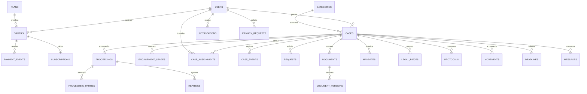

# Modelo de dados

> Modelo lógico para PostgreSQL/Django. Implementados e migrados localmente: User, ActionToken, MFADevice, RateLimitBucket, IdentityEmail, IdentityAudit e sessões Django. As entidades de negócio descritas abaixo são planejadas; nomes e campos futuros não equivalem ao schema físico atual.

## Convenções

Chaves UUID geradas no servidor; datas de evento em `timestamptz` UTC, exibidas em America/Sao_Paulo. Vencimentos jurídicos informados podem ser `date` com timezone explícito no lembrete. Valores monetários em centavos inteiros com moeda BRL. E-mail normalizado com unicidade; CPF normalizado, protegido e coletado apenas quando necessário. Estados em enums controlados ou tabelas de domínio. Entidades mutáveis têm `created_at`, `updated_at` e `version` para concorrência otimista.

## Entidades

| Entidade | Campos essenciais e restrições | Relações |
| --- | --- | --- |
| users | Usuário customizado Django: id UUID, email_normalized único, password com hash gerenciado pelo Django, name, status, email_verified_at, auth_version | Definir AUTH_USER_MODEL antes da primeira migração; 1:N sessões e papéis |
| user_roles | user_id, role, granted_by, granted_at; UNIQUE(user_id, role) | FK users; só backend administrativo concede |
| sessions | Sessões persistidas pelo backend de banco do Django: session_key, session_data, expire_date | Cookie contém identificador; expiração e logout revogam acesso |
| session_access | session_key único, user_id, portal, auth_version, issued_at, last_active_at, expires_at, revoked_at, mfa_verified_at | Registro de controle vinculado à sessão Django; recusar portal divergente, conta bloqueada, versão revogada e MFA pendente |
| invitations | id, email, role, token_hash, expires_at, accepted_at, invited_by | Aceite atômico e uso único |
| customer_profiles | user_id PK, cpf protegido, telefone e endereço mínimo | FK users; dados de cobrança não duplicados sem necessidade |
| plans | id, version, name, base_amount_cents, currency, term_months, active | Versão imutável referenciada no pedido |
| orders | id, user_id, plan_id, idempotency_key, payload_hash, status, amount_cents, provider_reference, quote_snapshot, expires_at | UNIQUE(user_id, idempotency_key); referência externa única quando presente |
| payment_events | id, provider, event_key, order_id, normalized_status, occurred_at, received_at, payload_digest, processed_at | UNIQUE(provider, event_key); armazenar só dados mínimos normalizados |
| subscriptions | id, user_id, order_id único, state, starts_at, ends_at, version | CHECK ends_at maior que starts_at; evitar períodos ativos sobrepostos |
| categories | id, name, active, required_fields_schema, eligibility_version | FK cases; inativação preserva histórico |
| cases | id, public_reference único, client_id, category_id, title, description, state, version, submitted_at, closed_at | FK users/categories; conteúdo protegido |
| proceedings | id, case_id, kind CIVIL/TRAFFIC, client_position, number opcional, authority, jurisdiction, current_stage, source, checked_at | Caso civil admite pré-ajuizamento sem número; número normalizado e órgão evitam vinculação duplicada no mesmo caso |
| proceeding_parties | id, proceeding_id, name, role, identifier protegido quando necessário | Dados de terceiros restritos aos autorizados; coleta mínima para conflito e atuação |
| engagement_stages | id, case_id, title, scope_version, included, owner_id, status, due_date, completed_at, evidence_version_id | Etapas contratadas e conclusão rastreável; sem prazo calculado automaticamente |
| hearings | id, proceeding_id, owner_id, starts_at, ends_at, timezone, location_or_private_url, status, version, outcome | Remarcação mantém histórico e cancela lembretes antigos; conflito de agenda alerta o responsável |
| case_assignments | id, case_id, lawyer_id, assigned_by, starts_at, ends_at, reason | Índice único parcial de case_id onde ends_at IS NULL |
| case_events | id, case_id, actor_id, type, visibility, previous_state, next_state, message, created_at | Append-only para eventos; não editar histórico para corrigir erro |
| requests | id, case_id, author_id, description, status, response, resolved_at, resume_state | Pendência de informação; retorno validado pela máquina de estados |
| documents | id, scope CASE/TEMPLATE, case_id, kind, visibility, created_by, current_version_id, deleted_at | CHECK case_id obrigatório em CASE e nulo em TEMPLATE; versão atual pertence ao mesmo documento |
| document_versions | id, document_id, number, object_key único, sha256, detected_mime, size_bytes, scan_status, uploaded_by, created_at | UNIQUE(document_id, number); máximo 20 MiB; versões imutáveis |
| mandate_templates | id, version, category_id, approved_by, approved_at, document_version_id, active | Aprovação de modelo registrada |
| mandates | id, case_id, template_id, generated_version_id, signed_version_id, status, reviewed_by, reviewed_at, reason | Arquivos devem pertencer ao mesmo caso |
| legal_pieces | id, case_id, draft_version_id, reviewed_version_id, published_version_id, reviewed_by, reviewed_at, published_at | Só publicar a versão revisada; FK document_versions |
| protocols | id, case_id, body_name, reference, submitted_at, proof_version_id, registered_by | Registro manual; comprovante obrigatório |
| movements | id, case_id, source, occurred_at, recorded_at, description, visibility, actor_id | Data externa separada da inserção |
| deadlines | id, case_id, owner_id, due_date, timezone, description, source, status, confirmed_by, version | Sem cálculo jurídico automático |
| messages | id, case_id, author_id, body_text, visibility, created_at | Imutável após envio no MVP; correção por nova mensagem |
| notifications | id, user_id, event_id, type, read_at, created_at | UNIQUE(user_id, event_id, type) |
| outbox_jobs | id, event_key único, type, payload_minimal, attempts, available_at, locked_until, status, last_error_code | Retry limitado e fila de falhas; sem conteúdo integral do caso |
| policy_versions | id, kind, version, content_hash, published_at | UNIQUE(kind, version) |
| policy_acceptances | id, user_id, policy_version_id, accepted_at, evidence_minimal | UNIQUE(user_id, policy_version_id) |
| privacy_requests | id, user_id, kind, status, verified_at, due_at, assigned_to, decision_reason, closed_at | Prazo de resposta definido pela política aprovada |
| retention_holds | id, case_id ou user_id, reason, authorized_by, review_at, released_at | CHECK exatamente um alvo; revisão periódica |
| access_grants | id, admin_id, case_id, approved_by, reason, expires_at, revoked_at | Acesso excepcional temporário; impedir autoaprovação |
| audit_events | id, actor_id, action, resource_type, resource_id, request_id, result, created_at, metadata_redacted | Inserção por serviço; atualização/exclusão restrita ao procedimento de retenção |
| exports | id, case_id ou privacy_request_id, requested_by, object_key, status, expires_at | Pacote privado; vínculo e autorização reavaliados no download |

Senhas são gerenciadas exclusivamente pelo Django, nunca em claro. Componentes mantidos tratarão MFA e verificação; segredos recuperáveis de MFA exigem proteção criptográfica e gestão de chaves. Tokens próprios de uso único usam hash e expiração. PAN, CVV e validade não fazem parte deste modelo. Os nomes acima são lógicos; as migrações definirão nomes físicos. Se Groups/Permissions representarem os papéis, usar uma única fonte de autorização e preservar evidências de concessão, sem manter listas divergentes de papéis.

## Diagrama principal

## Invariantes transacionais

- Troca de advogado encerra atribuição anterior e abre nova na mesma transação; índice parcial impede dois responsáveis.
- Submissão e transição fazem `UPDATE ... WHERE id = ? AND version = ?`, verificam linha afetada e gravam evento/outbox juntos. Conflito retorna 409.
- Confirmação financeira bloqueia o pedido, deduplica evento e cria no máximo uma assinatura por pedido. Renovação não sobrepõe período anterior; política exata deve ser validada em H-01.
- Publicação verifica versão revisada e vínculo ao caso; alterações posteriores exigem nova revisão.
- URLs e chaves de objeto não substituem autorização; consulta sempre aplica propriedade ou atribuição.
- Modelos usam scope TEMPLATE e autorização administrativa própria; advogado consome somente modelo aprovado na geração. Um documento CASE nunca muda de escopo para contornar autorização.
- Eliminação de dado avalia `retention_holds`, versões, exportações e backups; não usar cascade irrestrito em usuários/casos.

## Índices e migrações

Índices previstos: cases(client_id, state, updated_at), case_assignments(lawyer_id, ends_at), case_events(case_id, created_at, id), documents(case_id, kind), deadlines(owner_id, status, due_date), notifications(user_id, read_at, created_at), outbox_jobs(status, available_at), audit_events(resource_type, resource_id, created_at). Usar paginação por cursor estável para históricos.

Migrações Django versionadas e executadas uma vez por release, ensaiadas em homologação com dados sintéticos e backup anterior. Somente backend/worker acessam o banco; o Next.js não terá ORM nem migrações concorrentes. Alterações destrutivas usam expansão/migração/contração em entregas separadas. Reversão da aplicação deve continuar compatível com o esquema; restauração não é estratégia padrão para desfazer deploy, pois pode perder eventos financeiros novos. Critérios de recuperação em [Operação](OPERACAO.md).
