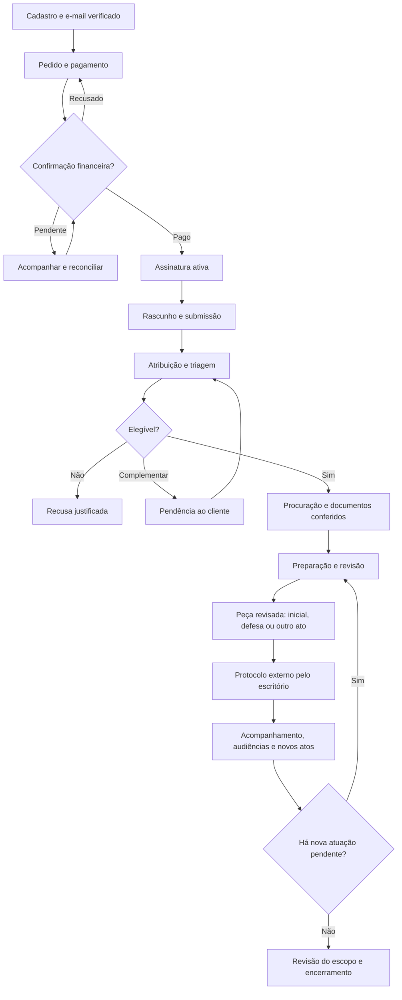
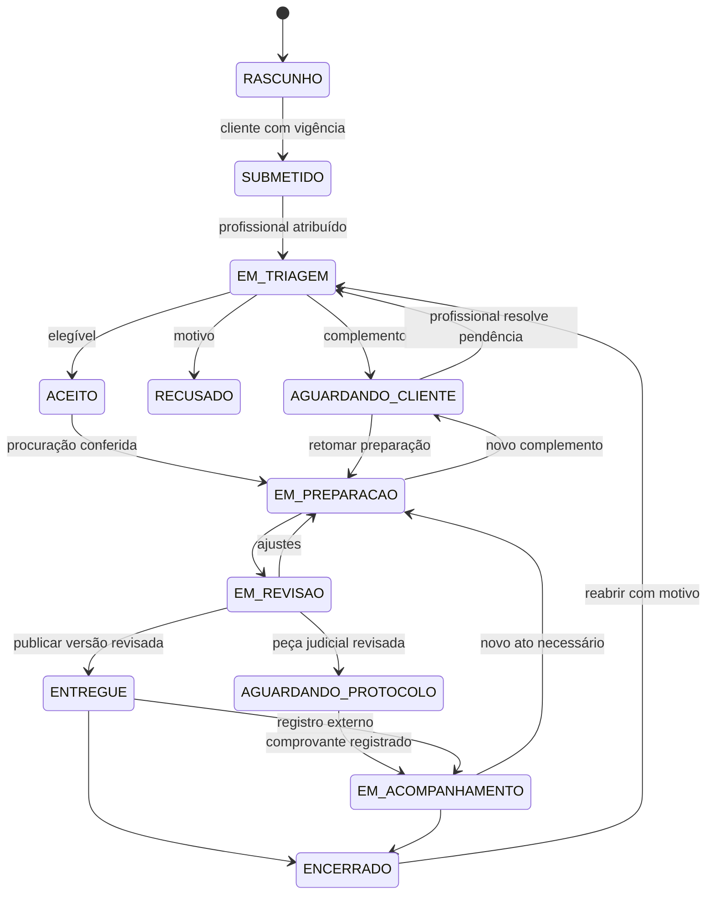
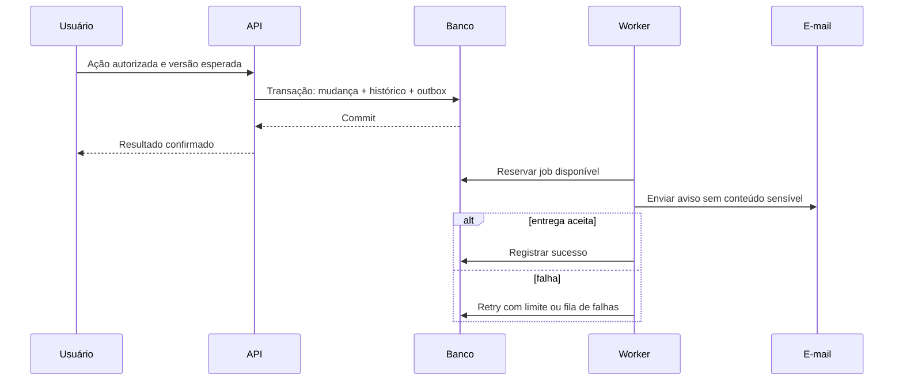

# Fluxos e máquinas de estados

> Estados canônicos propostos. O adaptador financeiro deve mapear os estados da API efetivamente habilitada.

## Jornada principal

## Estado do caso

| Origem → destino | Autor e pré-condição |
| --- | --- |
| RASCUNHO → SUBMETIDO | Cliente proprietário, campos válidos e assinatura vigente; não exige procuração conferida para submeter |
| SUBMETIDO → EM_TRIAGEM | Advogado já atribuído; atribuição é ato administrativo anterior |
| EM_TRIAGEM → AGUARDANDO_CLIENTE / RECUSADO / ACEITO | Advogado atribuído; motivo e checklist de triagem |
| ACEITO → EM_PREPARACAO | Advogado atribuído; documentos mínimos e procuração aprovada |
| EM_PREPARACAO → AGUARDANDO_CLIENTE | Pendência aberta registra `resume_state = EM_PREPARACAO` |
| AGUARDANDO_CLIENTE → estado de retorno | Advogado resolve todas as pendências bloqueantes; retorno só ao `resume_state` registrado, nunca escolhido arbitrariamente |
| EM_PREPARACAO → EM_REVISAO | Minuta completa disponível |
| EM_REVISAO → ENTREGUE | Versão exata revisada e publicada atomicamente |
| EM_REVISAO → AGUARDANDO_PROTOCOLO | Advogado confirma peça judicial revisada, etapa e prazo de protocolo; disponibilização ao cliente é evento de documento separado |
| AGUARDANDO_PROTOCOLO → EM_ACOMPANHAMENTO | Protocolo realizado pelo escritório em sistema oficial e comprovante vinculado; sem presumir automação |
| EM_ACOMPANHAMENTO → EM_PREPARACAO | Novo ato, resposta, recurso ou outra peça necessária dentro do escopo, sem apagar acompanhamento anterior |
| ENTREGUE → EM_ACOMPANHAMENTO | Registro de atuação externa aplicável; não significa protocolo automático |
| ENTREGUE / EM_ACOMPANHAMENTO → ENCERRADO | Advogado registra motivo e conclusão do escopo, sem prazo, audiência ou etapa bloqueante pendente; entrega de peça isolada não encerra atuação civil |
| ENCERRADO → EM_TRIAGEM | Advogado atribuído, motivo e política de atendimento satisfeita; sem gerar novo direito de atendimento automaticamente |

Estado RECUSADO encerra aquela submissão; cliente pode criar novo caso se elegível e com vigência. Exclusão de rascunho é lógica. Cancelamento solicitado pelo cliente em caso aceito vira pedido ao advogado, sem apagar caso, prazo ou evidência. Alteração concorrente usa `version` e retorna 409.

**Ramos civis:** cliente autor pode iniciar sem número de processo; após ajuizamento, registrar número/órgão/partes e comprovante. Cliente réu informa processo e documentos de citação/intimação disponíveis; advogado confirma prazos e defesa cabível. Acompanhamento oficial é responsabilidade do escritório, com movimentações inseridas manualmente na Iustus no MVP. Não inferir que prazo deixa de correr enquanto o cliente complementa documentos.

## Pedido e assinatura

Pedido: `CREATED → PENDING → PAID` ou `DECLINED / CANCELED`. Timeout após envio cria `UNKNOWN`; reconciliar antes de permitir nova tentativa financeira. Após pago, pode haver `REFUNDED / DISPUTED`; consulta autoritativa resolve eventos fora de ordem. Não aplicar uma ordenação numérica de status como se todos fossem progresso linear.

Assinatura: `PENDING → ACTIVE → EXPIRED`. Reembolso confirmado pode levar a `CANCELED`; contestação pode levar a `SUSPENDED` conforme política validada. Assinatura nunca fica ativa só porque a criação da transação retornou HTTP 200. Renovação cria novo pedido e período sem duplicar ou sobrepor indevidamente a vigência.

## Documento e procuração

Documento: `UPLOADING → QUARANTINED → AVAILABLE` ou `REJECTED`. Falha temporária do scanner permanece em quarentena com retry limitado. Versão anterior liberada permanece acessível mesmo quando nova versão ainda está em análise, conforme visibilidade.

Procuração: `GENERATED → AWAITING_SIGNATURE → SUBMITTED → APPROVED / REJECTED`. Após rejeição, novo arquivo gera nova submissão. Aprovação exige responsável e evidência de conferência; upload sozinho não comprova validade da assinatura.

## Efeitos assíncronos

